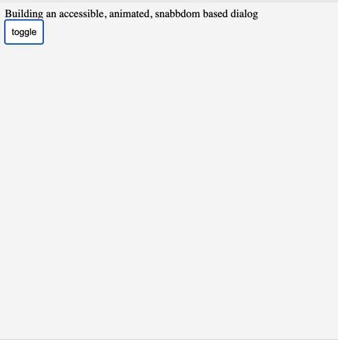

# snabbdom-dialog

an accessible, animated, snabbdom based dialog

see example.html for a complete working example.

This is still half-baked, there are a number of things that make this UI component difficult to package:

* close button is difficult because on one hand you want to be able customize what it looks like and where it is. On the other hand, in order to make the dialog accessible, you need to capture `TAB` key events on this element and force the focus back to the first element in the dialog. So we can have either close button flexibility or built-in accessible close behavior, but not both.
* because of the way focus works in the dom, it's not possible to declare focus with an html attribute. It must be done via javascript. This means having to keep references to the opener DOM element and the dialog DOM element (model.openerEl and model.dialogEl respectively.)
* has styles declared in `dialog.css`. Ideally this would be packaged within the component itself rather than being an external sheet.

I don't know how packageable this is today, but it's probably valuable at least putting this into a repository. Might be useful to someone, or future self.

